# NASDAQ Sentiment Scoring Flow

This diagram shows how the RunNasdaq sentiment system calculates the final composite score.

```mermaid
graph TD
    Start[Start: run_nasdaq_sentiment.py] --> Init[Initialize NASDAQ Ticker ^IXIC]

    Init --> FetchNews[Fetch News Articles]

    FetchNews --> CompanyNews[Company News<br/>Top 10 articles × 20 tickers<br/>Lines 291-322]
    FetchNews --> MarketNews[Market News<br/>Top 20 filtered articles<br/>Lines 325-366]

    CompanyNews --> CheckNew{New Articles<br/>Detected?<br/>Lines 721-755}
    MarketNews --> CheckNew

    CheckNew -->|No New Articles| CachedPath[CACHED PATH]
    CheckNew -->|New Articles Found| FullPath[FULL ANALYSIS PATH]

    %% CACHED PATH (No New Articles)
    CachedPath --> GetPrevious[Get Previous Run<br/>Lines 838-840]
    GetPrevious --> CalcDecay[Calculate Time Elapsed<br/>Minutes since last update<br/>Lines 892-893]
    CalcDecay --> ApplyDecay[Apply Exponential Decay<br/>decay_rate = 3.83% per minute<br/>Lines 896-904]

    ApplyDecay --> DecayFormula["decayed = previous × 0.9617^minutes<br/>Force to 0 if < 0.01<br/>Lines 232-258"]

    DecayFormula --> CachedNews[News Score = Decayed Value<br/>Line 899]

    %% FULL ANALYSIS PATH (New Articles)
    FullPath --> BatchCollect[Collect ALL Articles<br/>Company + Market<br/>Lines 1008-1040]

    BatchCollect --> CheckCache{Check Each<br/>Article Hash<br/>in Database?<br/>Lines 1046-1061}

    CheckCache -->|Cached| UseCached[Use Cached Sentiment<br/>Lines 1056-1057]
    CheckCache -->|New| BatchAPI[Send to FinBERT API<br/>Single Batch Request<br/>Lines 1064-1069]

    BatchAPI --> FinBERT["FinBERT Sentiment Analysis<br/>Returns: -1 to +1<br/>(positive - negative)<br/>Lines 129-176"]

    FinBERT --> CalcArticle[Calculate Article Score<br/>Lines 409-413]
    UseCached --> CalcArticle

    CalcArticle --> ArticleFormula["article_score =<br/>sentiment × 70% × 100<br/>+ surprise × 15% × 50<br/>+ credibility × 15% × 20<br/><br/>Range: ~-25 to +25"]

    ArticleFormula --> GroupByTicker[Group Articles by Ticker<br/>Lines 1086-1122]

    GroupByTicker --> AvgPerTicker[Average Score per Ticker<br/>Lines 1098-1101]

    AvgPerTicker --> WeightCompany["Company Sentiment =<br/>Σ(ticker_avg × market_cap_weight)<br/>Lines 1124-1129"]

    GroupByTicker --> AvgMarket[Average Market Articles<br/>Lines 1133-1145]

    AvgMarket --> MarketSentiment[Market Sentiment Score<br/>Line 1144]

    WeightCompany --> CombineNews["New Article Contribution =<br/>company_sentiment × 70%<br/>+ market_sentiment × 30%<br/>Lines 1173-1176"]
    MarketSentiment --> CombineNews

    CombineNews --> AddDecayed["News Composite =<br/>decayed_previous + new_contribution<br/>Capped at -100 to +100<br/>Lines 1179-1188"]

    AddDecayed --> FullNews[News Score = News Composite<br/>Line 1189]

    %% REDDIT SENTIMENT (Always Fresh)
    CachedNews --> RedditFetch[Fetch Reddit Posts/Comments<br/>Lines 758-786]
    FullNews --> RedditFetch

    RedditFetch --> RedditAnalyze[Analyze with FinBERT<br/>Batch Processing<br/>reddit_sentiment_analyzer.py]

    RedditAnalyze --> RedditScore[Reddit Score: -100 to +100<br/>Line 774]

    %% TECHNICAL INDICATORS (Always Fresh)
    RedditScore --> TechFetch[Fetch OHLCV Data<br/>Yahoo Finance → Finnhub fallback<br/>Lines 1191-1226]

    TechFetch --> TechCalc[Calculate Technical Indicators<br/>RSI, MACD, Bollinger, Stochastic<br/>Lines 1229-1234]

    TechCalc --> TechComposite[Technical Composite Score<br/>Weighted combination of signals<br/>Lines 1237-1238]

    TechComposite --> TechScore[Technical Score: -100 to +100<br/>Line 1238]

    %% ANALYST RECOMMENDATIONS (Cached or Fresh)
    TechScore --> AnalystCheck{New Recommendations<br/>Available?<br/>Lines 792-794}

    AnalystCheck -->|Yes| FetchAnalyst[Fetch from Finnhub<br/>Lines 582-671]
    AnalystCheck -->|No| UseCachedAnalyst[Use Previous Run Data<br/>Lines 806-827]

    FetchAnalyst --> AnalystCalc["Score = Σ(recommendations × market_cap)<br/>Strong Buy=+2, Buy=+1, Hold=0<br/>Sell=-1, Strong Sell=-2<br/>Normalized to -100 to +100<br/>Lines 619-657"]

    AnalystCalc --> AnalystScore[Analyst Score: -100 to +100<br/>Line 796]
    UseCachedAnalyst --> AnalystScore

    %% FINAL COMPOSITE
    AnalystScore --> FinalCalc[Calculate Final Composite<br/>Lines 1251-1256]

    FinalCalc --> FinalFormula["FINAL SCORE =<br/>news × 35%<br/>+ reddit × 20%<br/>+ technical × 25%<br/>+ analyst × 20%"]

    FinalFormula --> FinalScore[Final Composite Score<br/>Range: -100 to +100<br/>Line 1251]

    FinalScore --> SaveDB[Save to Database<br/>AnalysisRun.composite_score<br/>Lines 1267-1384]

    SaveDB --> End[End]

    %% STYLING
    classDef newsClass fill:#e1f5ff,stroke:#0288d1,stroke-width:2px
    classDef redditClass fill:#ffe0b2,stroke:#f57c00,stroke-width:2px
    classDef techClass fill:#f3e5f5,stroke:#7b1fa2,stroke-width:2px
    classDef analystClass fill:#fff9c4,stroke:#f9a825,stroke-width:2px
    classDef finalClass fill:#c8e6c9,stroke:#388e3c,stroke-width:3px
    classDef decisionClass fill:#ffccbc,stroke:#d84315,stroke-width:2px

    class CompanyNews,MarketNews,CheckCache,BatchAPI,FinBERT,CalcArticle,ArticleFormula,GroupByTicker,AvgPerTicker,WeightCompany,AvgMarket,MarketSentiment,CombineNews,AddDecayed,FullNews,CachedNews,GetPrevious,CalcDecay,ApplyDecay,DecayFormula newsClass
    class RedditFetch,RedditAnalyze,RedditScore redditClass
    class TechFetch,TechCalc,TechComposite,TechScore techClass
    class AnalystCheck,FetchAnalyst,UseCachedAnalyst,AnalystCalc,AnalystScore analystClass
    class FinalCalc,FinalFormula,FinalScore finalClass
    class CheckNew,CheckCache,AnalystCheck decisionClass
```

## Key Bottlenecks Causing Low Score Movement

### 1. **News Decay (Most Critical)**
- **Location**: Lines 232-258
- **Issue**: 3.83% decay per minute = 99% gone after 2 hours
- **Impact**: Even major news (+50) becomes insignificant (+0.5) within 120 minutes

### 2. **Article Score Compression**
- **Location**: Lines 409-413
- **Issue**:
  - FinBERT sentiment: -0.3 to +0.3 (conservative)
  - Multipliers too small (×100, ×50, ×20)
  - Result: -25 to +25 typical range
- **Impact**: Individual articles have minimal impact

### 3. **Averaging Dilution**
- **Location**: Lines 1098-1145
- **Issue**: 200+ articles averaged equally
- **Impact**: Strong signals (±30) diluted to ±5 after averaging

### 4. **Sticky Analyst Scores**
- **Location**: Lines 788-832
- **Issue**: Only updates when new recommendations available (rare)
- **Impact**: 20% of score is static for days, acting as anchor

### 5. **Component Value Ranges**
| Component | Typical Range | Weight | Contribution |
|-----------|---------------|--------|--------------|
| News | -5 to +5 | 35% | -1.75 to +1.75 |
| Reddit | -10 to +10 | 20% | -2 to +2 |
| Technical | -15 to +15 | 25% | -3.75 to +3.75 |
| Analyst | +10 to +20 | 20% | +2 to +4 |
| **TOTAL** | | | **-5.5 to +11.5** |

This is why you see scores stuck between -10 and +10.
